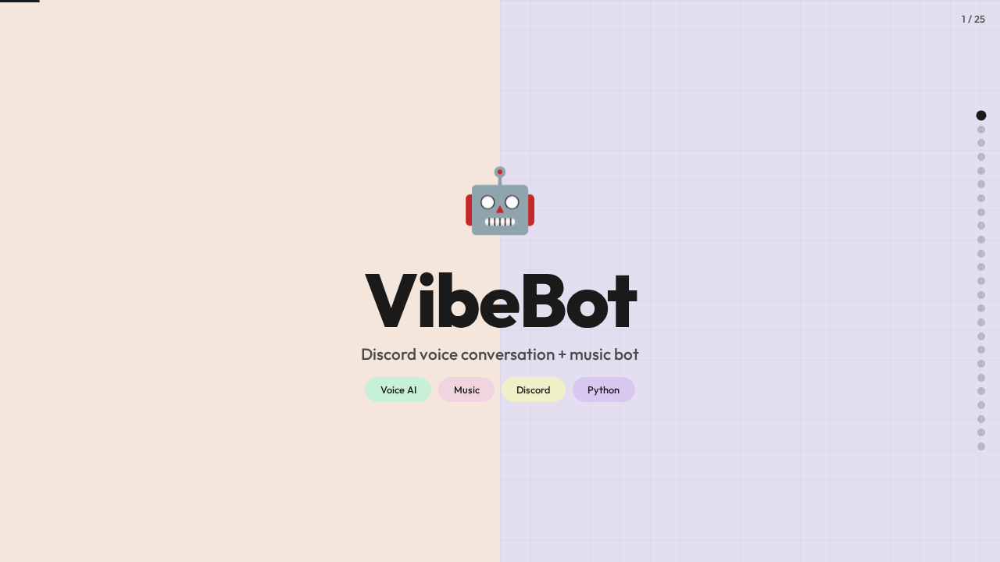
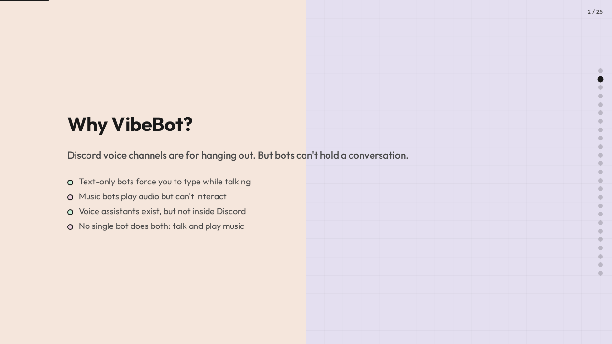
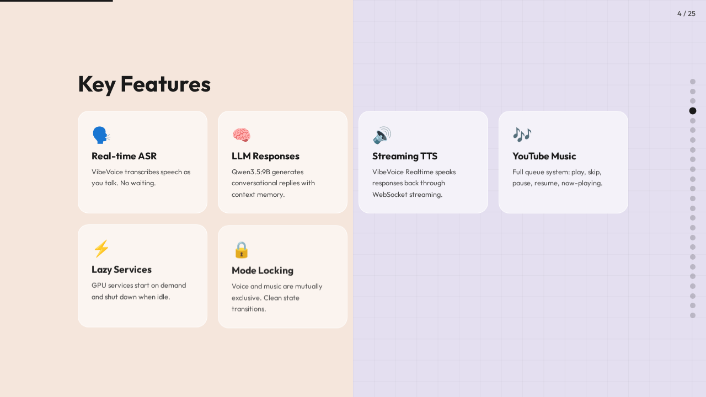
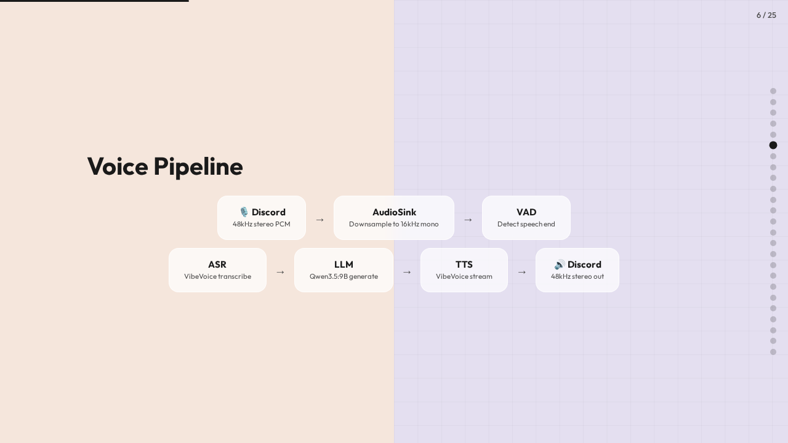
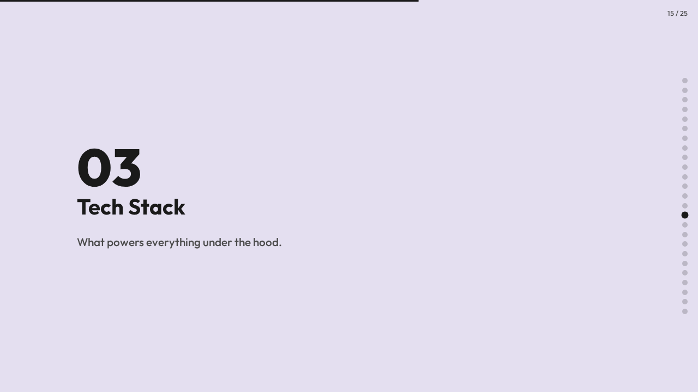
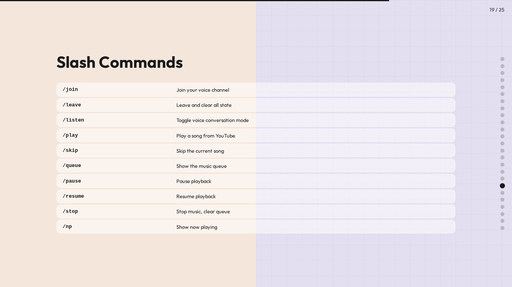

# VibeBot

<div align="center">

**[View Interactive Presentation](docs/slides/presentation.html)** | Animated overview of the project

</div>

<table>
<tr>
<td></td>
<td></td>
</tr>
<tr>
<td></td>
<td></td>
</tr>
<tr>
<td></td>
<td></td>
</tr>
</table>

Discord voice conversation + music bot. Uses Microsoft VibeVoice for real-time
speech-to-text and text-to-speech, with Qwen3.5:9B for generating responses.

## What it does

**Voice mode** (`/listen`): Talk in a voice channel and the bot responds
conversationally. Uses VibeVoice ASR to transcribe your speech, Qwen3.5:9B
to generate a response, and VibeVoice Realtime TTS to speak it back.

**Music mode** (`/play`): Play YouTube audio in a voice channel with standard
queue controls.

Voice and music are mutually exclusive. Stop one before starting the other.

## Requirements

- Python 3.12+
- FFmpeg
- NVIDIA GPU (for VibeVoice models)
- Discord bot token

## External services

These run as separate processes:

1. **VibeVoice ASR** (vLLM server, port 8000)
2. **VibeVoice Realtime TTS** (WebSocket server, port 3000)
3. **vLLM Qwen3.5:9B** (port 8010)

## Setup

```bash
# Clone VibeVoice
git clone https://github.com/microsoft/VibeVoice.git
cd VibeVoice && pip install -e .[streamingtts,vllm]

# Start ASR server
python vllm_plugin/scripts/start_server.py

# Start TTS server (separate terminal)
python demo/vibevoice_realtime_demo.py \
  --model_path microsoft/VibeVoice-Realtime-0.5B \
  --device cuda --port 3000

# Start LLM server (separate terminal)
vllm serve Qwen/Qwen3.5-9B --port 8010

# Install VibeBot
cd VibeBot
bash install.sh

# Edit config
vim config.yaml  # add your Discord token

# Run
conda activate vibebot
python -m src.bot
```

## Commands

| Command | Description |
|---------|-------------|
| `/join` | Join your voice channel |
| `/leave` | Leave and clear all state |
| `/listen` | Toggle voice conversation mode |
| `/play <query>` | Play a song from YouTube |
| `/skip` | Skip current song |
| `/queue` | Show the queue |
| `/pause` | Pause playback |
| `/resume` | Resume playback |
| `/stop` | Stop music, clear queue |
| `/np` | Show now playing |

## Tests

```bash
pytest tests/ -v
```
